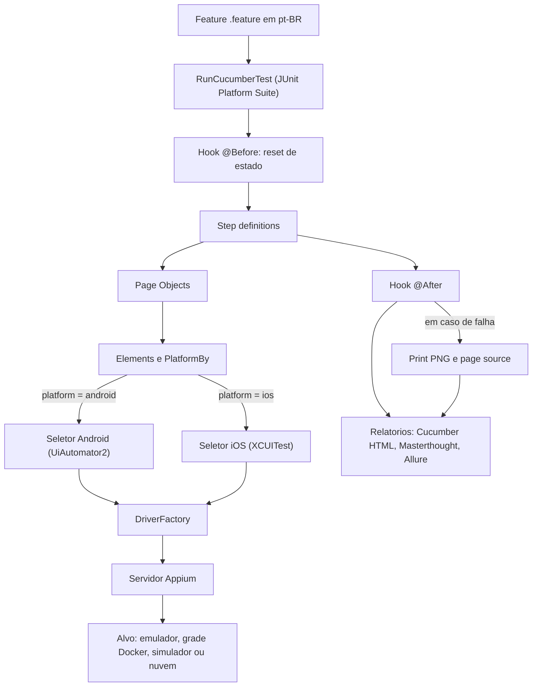
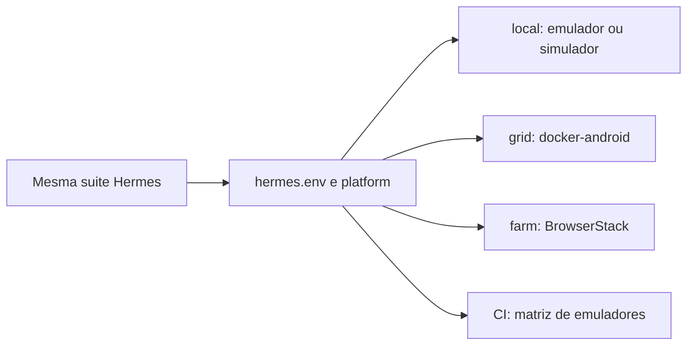
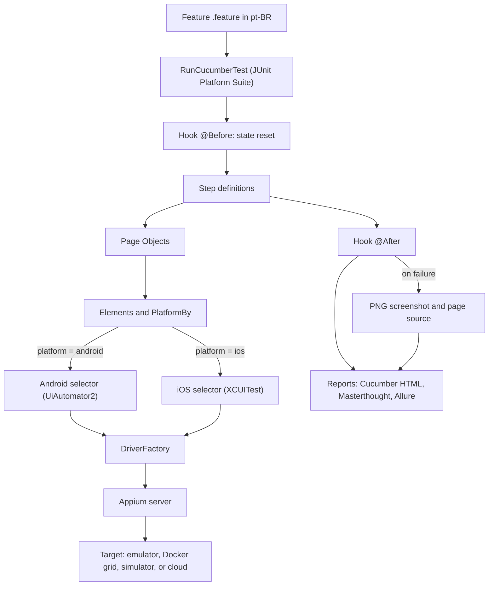
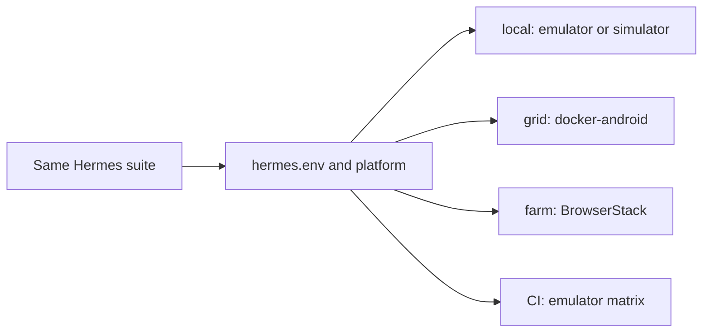

# Hermes

[](https://github.com/JonnasFigueiredo/Hermes/actions/workflows/mobile-tests.yml)


Framework de testes E2E mobile multiplataforma (Android e iOS) construído com Appium 2, Java 21, Maven, Cucumber (BDD) e JUnit 5, com geração de relatórios em Allure, Masterthought e HTML nativo do Cucumber. O aplicativo sob teste é o [Sauce Labs My Demo App RN](https://github.com/saucelabs/my-demo-app-rn) na versão 1.3.0 (build fixado por versão). Os cenários Gherkin são escritos em português do Brasil (`# language: pt`).

Navegação: [Português](#portugues) | [English](#english)

Relatório Allure publicado: https://jonnasfigueiredo.github.io/Hermes/

<a name="portugues"></a>

## Português

### Visão geral

Hermes é um framework de automação de testes de ponta a ponta para aplicativos mobile. A mesma suíte de cenários, escrita em linguagem de negócio (Gherkin), é executada em Android e iOS sem duplicação de código: apenas os seletores divergem entre as plataformas, e essa divergência fica isolada em uma única camada. O alvo de execução (emulador local, grade de containers ou nuvem de dispositivos) é tratado como configuração, nunca como alteração de código.

O projeto foi desenhado para refletir práticas reais de mercado em automação mobile e para ser totalmente verificável: tudo o que este documento afirma pode ser conferido nas execuções públicas de integração contínua e no relatório publicado.

### O que o projeto demonstra

1. Uma suíte, duas plataformas. Os mesmos cenários Gherkin guiam Android (driver UiAutomator2) e iOS (driver XCUITest) a partir de features, steps e page objects compartilhados. Somente os seletores mudam, resolvidos por plataforma através da classe `PlatformBy`. A suíte completa de 21 cenários é verificada verde na matriz de emuladores Android; a suíte de smoke, incluindo o fluxo de compra de ponta a ponta, é verificada verde no simulador iOS.
2. BDD com Cucumber. São 21 cenários (contando as expansões de Esquema de Cenário) distribuídos em cinco features: login, catálogo, detalhes do produto, carrinho e checkout completo. Há uso de Esquema de Cenário com tabelas de exemplos.
3. Page Objects com composição. Cada tela tem uma página (comportamento) apoiada por uma classe de elementos (somente seletores). O componente de navegação `NavBar` é compartilhado por composição, e não por herança.
4. Steps reutilizáveis e parametrizados. Expressões do Cucumber como `o usuário adiciona o produto {int} ao carrinho` mantêm um vocabulário pequeno e combinável entre as features.
5. Reset de estado determinístico. Antes de cada cenário o estado do aplicativo é zerado (no Android, limpando os dados do app; no iOS, pela função documentada de long-press no logo do cabeçalho), garantindo cenários totalmente independentes e sempre deslogados.
6. Gestos nativos modernos. Long-press e rolagem são implementados com comandos `mobile:` específicos de cada plataforma. Não há uso da API legada TouchAction.
7. Apenas esperas explícitas. A sincronização é feita exclusivamente com WebDriverWait. Não existe Thread.sleep em nenhum ponto do código.
8. Evidência de falha. Um hook do Cucumber captura, a cada falha, um print em PNG e o page source da tela, anexando o print ao relatório Allure. O page source foi a ferramenta que permitiu portar os seletores para iOS de forma precisa.
9. Integração contínua em dispositivos reais e containers. O GitHub Actions executa a suíte em uma matriz de emuladores Android (com aceleração KVM), em uma grade docker-android conteinerizada e em um simulador iOS num runner macOS.

### Stack técnico

| Componente | Versão |
| --- | --- |
| Java | 21 (Temurin) |
| Maven | 3.9 |
| Appium java-client | 9.5.0 |
| Selenium | 4.34.0 (fixado) |
| JUnit 5 (Platform Suite) | 5.14.4 |
| Cucumber JVM | 7.34.3 |
| Allure (cucumber7-jvm) | 2.35.2 |
| Masterthought (maven-cucumber-reporting) | 5.11.0 |

### Arquitetura

```
src/test/java/io/hermes/
  core/        Config, Platform, DriverFactory, DriverManager, Gestures, NativeDialogs
  elements/    Uma classe de seletores por tela, mais PlatformBy (resolucao por plataforma)
  pages/       Page objects: Login, Catalog, Product, Cart, Checkout (Address, Payment,
    |          Review, Complete) com acoes e auxiliares de verificacao
    components/  NavBar (cabecalho e navegacao), compartilhado por composicao
  model/       Massa de dados: User, Address, PaymentCard
  steps/       Hooks mais step definitions (pt-BR) por feature
  RunCucumberTest.java   Runner do tipo JUnit Platform Suite

src/test/resources/
  features/    login, catalog, product, cart, checkout (.feature, pt-BR)
  config/      local.properties, grid.properties, farm.properties (perfis de execucao)
```

A separação em quatro camadas (elementos, páginas, steps e features) mantém cada responsabilidade isolada. Quando um seletor muda no aplicativo, há um único lugar para corrigir. Quando um fluxo de negócio muda, a feature e os steps refletem isso sem tocar nos seletores.

### Como funciona (fluxo de execução)

O diagrama abaixo mostra o caminho de um cenário, desde o arquivo Gherkin até o relatório. O ponto central é que a camada de elementos resolve o seletor correto por plataforma e a fábrica de driver decide entre Android e iOS, enquanto features, steps e páginas permanecem os mesmos.



O mesmo conjunto de testes aponta para diferentes alvos apenas por configuração, sem alterar uma linha de código:



### Suporte multiplataforma

O núcleo é agnóstico de plataforma. A `DriverFactory` cria um `AndroidDriver` ou um `IOSDriver` conforme a configuração `platform`, e todo o restante trabalha com a abstração `AppiumDriver`. Onde Android e iOS realmente divergem, a resolução acontece em pontos controlados:

| Aspecto | Android | iOS |
| --- | --- | --- |
| Navegação principal | menu lateral (hamburguer) | barra de abas inferior |
| Abrir menu | seletor `open menu` | seletor `tab bar option menu` |
| Carrinho | seletor `cart badge` | seletor `tab bar option cart` |
| Itens do catálogo | container `store item` | texto `store item text` (a célula colapsa no iOS) |
| Teclado de texto | dispensa nativa | toque na tecla Return |
| Teclado numérico | dispensa nativa | toque no cabeçalho neutro |
| Reset de estado | limpeza de dados do app | long-press documentado |

Essas diferenças foram descobertas lendo o page source real capturado nas falhas de CI, e não por suposição. Um detalhe ilustra bem o valor de testar nas duas plataformas: o número de cartão usado originalmente passava no Android mas era rejeitado pela validação Luhn no iOS, o que só ficou evidente ao rodar a mesma suíte no simulador.

### Cenários cobertos

Login: login válido leva ao catálogo; credenciais rejeitadas exibem mensagem de erro (Esquema de Cenário com usuário inválido e usuário bloqueado); validação de campos obrigatórios; logout encerra a sessão.

Catálogo: listagem de produtos ao abrir o app; detalhes do produto exibem preço e botão de adicionar; ordenação por nome e por preço, crescente e decrescente (Esquema de Cenário).

Produto: contador de quantidade aumenta e diminui; adição ao carrinho com quantidade maior que um.

Carrinho: adicionar um produto enche o carrinho; adicionar dois produtos distintos; remover o único item esvazia o carrinho; carrinho vazio leva de volta às compras.

Checkout: compra completa de ponta a ponta (endereço, pagamento, revisão e conclusão); checkout exige autenticação; pagamento sem número de cartão é bloqueado.

### Como rodar localmente

Pré-requisitos: JDK 21, Maven, Node.js, Android SDK com um emulador (ou um dispositivo físico) e Appium 2 com o driver UiAutomator2.

```
npm install -g appium
appium driver install uiautomator2
```

Passos:

```
# 1. Baixar o APK fixado para apps/ (ignorado pelo git)
bash scripts/download-app.sh

# 2. Subir um emulador e o servidor Appium
appium

# 3. Rodar a suíte completa
mvn test

# Apenas o subconjunto de smoke
mvn test -Dgroups=smoke

# Validar as ligações de steps sem dispositivo
mvn test -Dcucumber.execution.dry-run=true
```

No Eclipse ou IntelliJ, basta executar a classe `RunCucumberTest` como um teste JUnit.

### Relatórios

São três relatórios, cada um com um papel distinto:

| Relatório | Quando é gerado | Onde |
| --- | --- | --- |
| HTML do Cucumber (evidência imediata) | a cada execução, inclusive na IDE | `target/cucumber-report/cucumber.html` |
| Masterthought (HTML rico, gráficos por feature, tag e step) | em `mvn verify` e no CI | `target/cucumber-html-reports/overview-features.html` |
| Allure (análise profunda, anexos, histórico entre execuções) | `mvn allure:serve` local; publicado no GitHub Pages pelo CI | `target/allure-results` e a página publicada |

```
mvn verify          # roda a suíte e gera o relatório Masterthought
mvn allure:serve    # gera e abre o relatório Allure
```

Cenários que falham incluem o print da tela como anexo nos relatórios.

### Integração contínua

O fluxo principal de CI ([mobile-tests.yml](.github/workflows/mobile-tests.yml)) tem três jobs:

1. Compile gate. Executa `mvn test-compile` e um dry-run do Cucumber para falhar cedo diante de código quebrado ou step não ligado.
2. E2E em matriz de dispositivos. Habilita KVM e roda a suíte em uma matriz de emuladores (API 30 com perfil pixel_4 e API 33 com perfil pixel_6): o mesmo código em dispositivos diferentes. Os resultados Allure são sempre publicados como artefatos; prints e log do Appium são publicados em caso de falha.
3. Report. Combina os resultados Allure de todos os dispositivos e publica o relatório, com histórico de execuções, no GitHub Pages.

Execuções também podem ser disparadas manualmente pela aba Actions (workflow_dispatch), escolhendo o subconjunto de testes.

Fluxos adicionais:

* [ios-tests.yml](.github/workflows/ios-tests.yml) executa a suíte de smoke em um simulador iPhone num runner macOS (gratuito para repositórios públicos), incluindo o checkout de ponta a ponta.
* [grid-smoke.yml](.github/workflows/grid-smoke.yml) valida a grade docker-android usando o KVM disponível nos runners ubuntu.
* [farm-tests.yml](.github/workflows/farm-tests.yml) executa a suíte em dispositivos reais no BrowserStack App Automate (requer credenciais configuradas como secrets do repositório).

### Grade Docker (device farm local)

A pasta [docker/](docker/README.md) traz um arquivo compose que sobe vários emuladores conteinerizados com perfis de dispositivo diferentes (docker-android), com visualização via noVNC no navegador e um servidor Appium por container. O requisito é um host Linux com KVM. Não funciona em hosts Windows ou macOS; os detalhes estão no README da pasta. O fluxo de smoke da grade valida esse cenário usando o KVM dos runners ubuntu.

### Configuração e perfis de execução

A suíte nunca sabe onde está rodando. O perfil é escolhido com `-Dhermes.env=<nome>` (ou a variável `HERMES_ENV`), carregando `src/test/resources/config/<nome>.properties`:

| Perfil | Alvo |
| --- | --- |
| local (padrão) | emulador ou dispositivo com Appium nesta máquina |
| grid | dispositivos conteinerizados (docker-android, hosts Linux com KVM) |
| farm | nuvem de dispositivos (formato BrowserStack App Automate; credenciais somente por variáveis de ambiente) |

Toda chave pode ser sobrescrita por execução, com a precedência: propriedade de sistema, depois variável de ambiente, depois arquivo do perfil, depois padrão.

| Chave (`-D`) | Variável de ambiente | Padrão | Descrição |
| --- | --- | --- | --- |
| `platform` | `PLATFORM` | `android` | `android` ou `ios` |
| `appium.url` | `APPIUM_URL` | `http://127.0.0.1:4723` | URL do servidor Appium, grade ou nuvem |
| `app.path` | `APP_PATH` | caminho do APK | caminho do app, ou id de app de nuvem |
| `device.name` | `DEVICE_NAME` | `Android Emulator` ou `iPhone 15` | nome do dispositivo |
| `timeout.default` | `TIMEOUT_DEFAULT` | `15` | tempo de espera explícita em segundos; o CI usa 30 |
| `timeout.short` | `TIMEOUT_SHORT` | `5` | tempo de espera para sondagens; o CI usa 10 |

Os perfis ainda podem declarar capabilities específicas de cada provedor com o prefixo `capability.` (por exemplo `capability.appium:platformVersion=13.0`), repassadas como estão pela `DriverFactory`. Integrar uma nova grade ou nuvem não exige alteração de código.

### Roadmap

Os princípios de arquitetura e as fases do projeto estão em [ROADMAP.md](ROADMAP.md). As fases de núcleo estão concluídas e verdes. Os próximos passos documentados são: paridade completa da regressão iOS, ativação do perfil de nuvem BrowserStack e integração de observabilidade com ReportPortal.

### Aviso legal

Este é um projeto pessoal e independente, desenvolvido para fins de estudo e portfólio. Ele não representa, não está associado e não reflete a posição de nenhuma empresa, empregador ou organização. Quaisquer marcas, produtos ou nomes de terceiros eventualmente citados pertencem aos seus respectivos titulares e são mencionados somente para fins descritivos e de interoperabilidade técnica, sem qualquer vínculo, patrocínio ou endosso.

O aplicativo utilizado como alvo de teste pertence ao seu respectivo titular e é empregado exclusivamente como alvo público de automação, sem redistribuição, modificação ou versionamento de seus binários neste repositório. O código deste framework é distribuído sob a licença MIT; as dependências seguem suas respectivas licenças. O software é fornecido no estado em que se encontra, sem garantias de qualquer natureza.

### Licença

[MIT](LICENSE)

<a name="english"></a>

## English

### Overview

Hermes is an end-to-end test automation framework for mobile applications. The same suite of scenarios, written in business language (Gherkin), runs on Android and iOS without code duplication: only the selectors differ between platforms, and that divergence is isolated in a single layer. The execution target (local emulator, container grid, or cloud device farm) is treated as configuration, never as a code change.

The project was designed to reflect real market practices in mobile automation and to be fully verifiable: everything this document states can be checked in the public continuous integration runs and in the published report.

### What this project demonstrates

1. One suite, two platforms. The same Gherkin scenarios drive Android (UiAutomator2 driver) and iOS (XCUITest driver) from shared features, steps, and page objects. Only the selectors change, resolved per platform through the `PlatformBy` class. The full 21-scenario suite is verified green on the Android emulator matrix; the smoke suite, including the full end-to-end checkout, is verified green on the iOS simulator.
2. BDD with Cucumber. There are 21 scenarios (counting Scenario Outline expansions) across five features: login, catalog, product details, cart, and full checkout. Scenario Outline with example tables is used where it fits.
3. Page Objects with composition. Each screen has a page (behavior) backed by an elements class (selectors only). The `NavBar` navigation component is shared by composition, not by inheritance.
4. Reusable, parameterized steps. Cucumber expressions such as `o usuário adiciona o produto {int} ao carrinho` keep the step vocabulary small and composable across features.
5. Deterministic state reset. Before every scenario the app state is reset (on Android by clearing the app data; on iOS through the documented header-logo long-press), keeping scenarios fully independent and always logged out.
6. Modern native gestures. Long-press and scroll are implemented with platform-specific `mobile:` commands. The legacy TouchAction API is not used.
7. Explicit waits only. Synchronization is done exclusively with WebDriverWait. There is no Thread.sleep anywhere in the codebase.
8. Failure evidence. A Cucumber hook captures, on each failure, a PNG screenshot and the page source, attaching the screenshot to the Allure report. The page source was the tool that allowed porting the selectors to iOS precisely.
9. Continuous integration on real devices and containers. GitHub Actions runs the suite on a matrix of Android emulators (with KVM acceleration), on a containerized docker-android grid, and on an iOS simulator on a macOS runner.

### Technical stack

| Component | Version |
| --- | --- |
| Java | 21 (Temurin) |
| Maven | 3.9 |
| Appium java-client | 9.5.0 |
| Selenium | 4.34.0 (pinned) |
| JUnit 5 (Platform Suite) | 5.14.4 |
| Cucumber JVM | 7.34.3 |
| Allure (cucumber7-jvm) | 2.35.2 |
| Masterthought (maven-cucumber-reporting) | 5.11.0 |

### Architecture

```
src/test/java/io/hermes/
  core/        Config, Platform, DriverFactory, DriverManager, Gestures, NativeDialogs
  elements/    One selector class per screen, plus PlatformBy (per-platform resolution)
  pages/       Page objects: Login, Catalog, Product, Cart, Checkout (Address, Payment,
    |          Review, Complete) with actions and assertion helpers
    components/  NavBar (header and navigation), shared by composition
  model/       Test data: User, Address, PaymentCard
  steps/       Hooks plus step definitions (pt-BR) per feature
  RunCucumberTest.java   JUnit Platform Suite runner

src/test/resources/
  features/    login, catalog, product, cart, checkout (.feature, pt-BR)
  config/      local.properties, grid.properties, farm.properties (execution profiles)
```

The four-layer separation (elements, pages, steps, and features) keeps each responsibility isolated. When a selector changes in the app, there is a single place to fix. When a business flow changes, the feature and the steps reflect it without touching the selectors.

### How it works (execution flow)

The diagram below shows the path of a scenario, from the Gherkin file to the report. The key idea is that the elements layer resolves the correct selector per platform and the driver factory decides between Android and iOS, while features, steps, and pages stay the same.



The same test suite points to different targets by configuration alone, without changing a single line of code:



### Cross-platform support

The core is platform-agnostic. The `DriverFactory` creates an `AndroidDriver` or an `IOSDriver` according to the `platform` configuration, and everything else works with the `AppiumDriver` abstraction. Where Android and iOS genuinely diverge, resolution happens at controlled points:

| Aspect | Android | iOS |
| --- | --- | --- |
| Main navigation | side drawer (hamburger) | bottom tab bar |
| Open menu | selector `open menu` | selector `tab bar option menu` |
| Cart | selector `cart badge` | selector `tab bar option cart` |
| Catalog items | container `store item` | text `store item text` (the cell collapses on iOS) |
| Text keyboard | native dismissal | tap the Return key |
| Numeric keyboard | native dismissal | tap the neutral header |
| State reset | clear app data | documented long-press |

These differences were discovered by reading the real page source captured on CI failures, not by guessing. One detail illustrates the value of testing on both platforms: the card number used originally passed on Android but was rejected by Luhn validation on iOS, which only became evident when running the same suite on the simulator.

### Covered scenarios

Login: a valid login lands on the catalog; rejected credentials show an error message (Scenario Outline with an invalid user and a locked-out user); required-field validation; logout ends the session.

Catalog: products are listed on launch; product details show price and the add-to-cart button; sorting by name and by price, ascending and descending (Scenario Outline).

Product: the quantity counter increases and decreases; adding to the cart with a quantity greater than one.

Cart: adding a product fills the cart; adding two distinct products; removing the only item empties the cart; an empty cart leads back to shopping.

Checkout: full end-to-end purchase (address, payment, review, and completion); checkout requires authentication; payment without a card number is blocked.

### Running locally

Prerequisites: JDK 21, Maven, Node.js, Android SDK with an emulator (or a physical device), and Appium 2 with the UiAutomator2 driver.

```
npm install -g appium
appium driver install uiautomator2
```

Steps:

```
# 1. Download the pinned APK into apps/ (gitignored)
bash scripts/download-app.sh

# 2. Start an emulator and the Appium server
appium

# 3. Run the full suite
mvn test

# Only the smoke subset
mvn test -Dgroups=smoke

# Validate step bindings without a device
mvn test -Dcucumber.execution.dry-run=true
```

In Eclipse or IntelliJ, run the `RunCucumberTest` class as a JUnit test.

### Reports

There are three reports, each with a distinct role:

| Report | When it is produced | Where |
| --- | --- | --- |
| Cucumber HTML (instant evidence) | every run, including in the IDE | `target/cucumber-report/cucumber.html` |
| Masterthought (rich HTML, charts per feature, tag, and step) | on `mvn verify` and on CI | `target/cucumber-html-reports/overview-features.html` |
| Allure (deep analysis, attachments, run history) | `mvn allure:serve` locally; published to GitHub Pages by CI | `target/allure-results` and the published page |

```
mvn verify          # runs the suite and builds the Masterthought report
mvn allure:serve    # builds and opens the Allure report
```

Failing scenarios include the screenshot as an attachment in the reports.

### Continuous integration

The main CI workflow ([mobile-tests.yml](.github/workflows/mobile-tests.yml)) has three jobs:

1. Compile gate. Runs `mvn test-compile` and a Cucumber dry-run to fail early on broken code or an unbound step.
2. Device-matrix E2E. Enables KVM and runs the suite on a matrix of emulators (API 30 with the pixel_4 profile and API 33 with the pixel_6 profile): the same code on different devices. Allure results are always uploaded as artifacts; screenshots and the Appium log are uploaded on failure.
3. Report. Merges the Allure results from all devices and publishes the report, with run history, to GitHub Pages.

Runs can also be triggered manually from the Actions tab (workflow_dispatch), choosing the test subset.

Additional workflows:

* [ios-tests.yml](.github/workflows/ios-tests.yml) runs the smoke suite on an iPhone simulator on a macOS runner (free for public repositories), including the end-to-end checkout.
* [grid-smoke.yml](.github/workflows/grid-smoke.yml) validates the docker-android grid using the KVM available on ubuntu runners.
* [farm-tests.yml](.github/workflows/farm-tests.yml) runs the suite on real devices on BrowserStack App Automate (requires credentials configured as repository secrets).

### Docker grid (local device farm)

The [docker/](docker/README.md) folder ships a compose file that boots multiple containerized emulators with different device profiles (docker-android), with noVNC viewing in the browser and one Appium server per container. The requirement is a Linux host with KVM. It does not work on Windows or macOS hosts; the details are in the folder README. The grid smoke workflow validates this scenario using the KVM on ubuntu runners.

### Configuration and execution profiles

The suite never knows where it runs. The profile is chosen with `-Dhermes.env=<name>` (or the `HERMES_ENV` variable), loading `src/test/resources/config/<name>.properties`:

| Profile | Target |
| --- | --- |
| local (default) | emulator or device with Appium on this machine |
| grid | containerized devices (docker-android, Linux hosts with KVM) |
| farm | cloud device farm (BrowserStack App Automate shape; credentials only through environment variables) |

Every key can be overridden per run, with the precedence: system property, then environment variable, then profile file, then default.

| Key (`-D`) | Environment variable | Default | Description |
| --- | --- | --- | --- |
| `platform` | `PLATFORM` | `android` | `android` or `ios` |
| `appium.url` | `APPIUM_URL` | `http://127.0.0.1:4723` | Appium server, grid, or cloud URL |
| `app.path` | `APP_PATH` | APK path | app path, or cloud app id |
| `device.name` | `DEVICE_NAME` | `Android Emulator` or `iPhone 15` | device name |
| `timeout.default` | `TIMEOUT_DEFAULT` | `15` | explicit-wait timeout in seconds; CI uses 30 |
| `timeout.short` | `TIMEOUT_SHORT` | `5` | probe timeout in seconds; CI uses 10 |

Profiles can also declare provider-specific capabilities with the `capability.` prefix (for example `capability.appium:platformVersion=13.0`), forwarded as-is by the `DriverFactory`. Integrating a new grid or cloud requires no code change.

### Roadmap

The architecture principles and project phases are in [ROADMAP.md](ROADMAP.md). The core phases are complete and green. The documented next steps are: full iOS regression parity, activation of the BrowserStack cloud profile, and observability integration with ReportPortal.

### Disclaimer

This is a personal and independent project, built for study and portfolio purposes. It does not represent, is not associated with, and does not reflect the position of any company, employer, or organization. Any third-party trademarks, products, or names that may be cited belong to their respective owners and are mentioned only for descriptive and technical interoperability purposes, without any affiliation, sponsorship, or endorsement.

The application used as a test target belongs to its respective owner and is used solely as a public automation target, without redistribution, modification, or version control of its binaries in this repository. This framework code is distributed under the MIT license; the dependencies follow their respective licenses. The software is provided as is, without warranties of any kind.

### License

[MIT](LICENSE)
